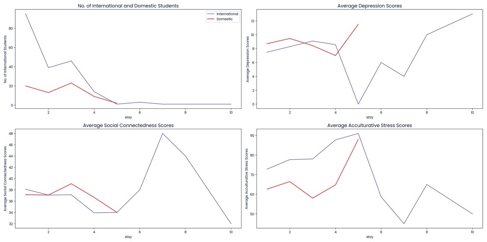

# Analyzing Students' Mental Health with SQL
## Overview
This project aimed to analyze the mental health of international students from a Japanese international university using SQL to gain insights and Python for data visualization. It utilized a dataset called [students.csv](data/students.csv), which contains information about various scores related to international students' mental health. Insights from SQL suggest that international students staying longer at Japanese International University tend to have higher average depression scores, although the average acculturative stress (stress associated with joining a new culture) scores decrease with longer stays. 
## Circumstance Understanding
A [recent study](https://www.ncbi.nlm.nih.gov/pmc/articles/PMC10903817/#:~:text=Conclusions,university%20students%2C%20especially%20international%20students.) showed that international students experienced poorer mental health compared to domestic students, highlighting a need for action to assist the international students. Hence, in this project, we want to examine whether the length of stay is a contributing factor to the mental health of international students by looking into their length of stay and average scores of depression, social connectedness, and acculturative stress. By examining these parameters, we can recommend which actions or implementations could benefit international students' mental health.
## Data Understanding
The data consisted of 201 international students. The features included `todep` total score of depression (PHQ-9 test), `tosc` total score of social connectedness (SCS test), and `toas` total score of acculturative stress (ASISS test). Using SQL, international students were grouped by the length of stay (in years), and the average scores of depression, social connectedness, and acculturative stress for each category of stay length were calculated.
## [Data Insights](https://github.com/salaikht9228/SQL-Students-Mental-Health/blob/main/Student_MentalHealth.ipynb)
In general, international students staying longer at Japanese International University tend to have higher average depression scores. Here are some interesting findings from the graphs:

> * Students who stayed for at most 5 years had similar average depression and social connectedness scores between international and domestic students. However, the average acculturative stress scores were higher for international students compared to domestic students. This suggests that more cultural immersion programs, such as homestays or pairing international students with Japanese students, could help reduce acculturative stress.
> * There is a drop in average depression scores among international students in the 5th year, possibly due to graduating and looking forward to returning to their own countries.
> * Among students who stayed for more than 5 years, there seems to be a relationship between social connectedness and depression. Students in their 6th year had higher average social connectedness scores than those in their 10th year, while the opposite trend was observed for the average depression scores. This suggests that belonging to a social group may benefit international students' mental health and reduce depression. Thus, organizing more social groups for international students may help their mental health.
> * The average acculturative stress scores decrease as international students stay longer, possibly indicating that they become better accustomed to Japanese culture and tradition after staying for more than 5 years.
## Conclusion
In conclusion, it would be advisable to consider implementing more programs that promote cultural immersion and social connectedness, as these can positively impact international students' mental health. Due to the small number of international students who stay at the university for more than 5 years, caution must be applied when interpreting the data since there was only one student in each of 7, 8, and 10 years of stay. Therefore, more data should be gathered for students in 7, 8, and 10 years of stay.
